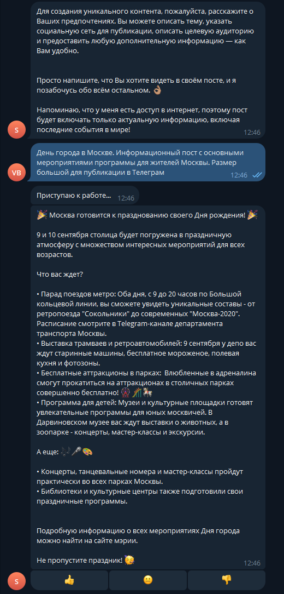
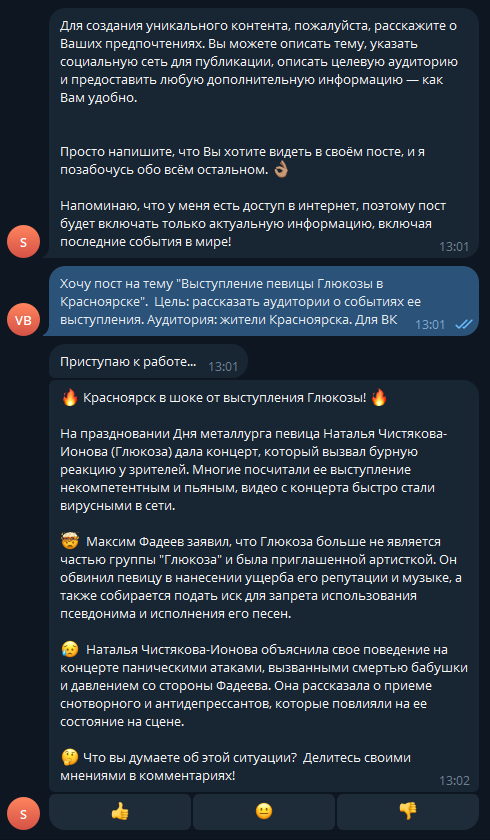
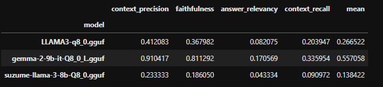
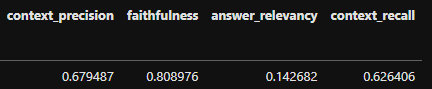

# Статейкин

Статейкин — это умный чат-бот для Telegram, который помогает пользователям генерировать качественный контент для социальных сетей. Основанный на мощных моделях LLM (Large Language Model) и оснащённый возможностями веб-поиска, Статейкин обеспечивает создание актуальных и увлекательных постов.

## Возможности

- **Генерация контента**: Создание уникальных постов на основе заданной темы.
- **Адаптация под аудиторию**: Учет целевой аудитории и социальной сети для публикации.
- **Актуальная информация**: Включение последних мировых событий благодаря интеграции с веб-поиском.
- **Простота использования**: Интуитивно понятный интерфейс и удобные команды.

## Установка и запуск

### Требования

- Docker и Docker Compose
- Telegram Bot API Token
- GOOGLE_API_KEY
- GOOGLE_CSE_ID

### Шаги для установки

1. Клонируйте репозиторий:
   ```bash
   git clone https://github.com/Khoreks/Stateykin.git
   cd Stateykin
   ```
2. Заполнить все файлы .env.template
3. Запустите проект с помощью Docker Compose:
   ```bash
   docker-compose up --build
   ```
## Использование
### Команды бота
* `/start` - Регистрация и приветственное сообщение.
* `/help` - Информация по использованию сервиса.
* `/new_post` - Инициация процесса генерации нового поста.
* `/sub_info` - Получение информации по текущей подписке.
* `/sub_buy` - Функционал приобритения подписки.
   
### Пример работы №1

### Пример работы №2


## Метрики
С выводами и подробным рассмотрением решений можно [ознакомится тут](https://github.com/Khoreks/Stateykin/tree/notebooks)
### Baseline 


### Итог
